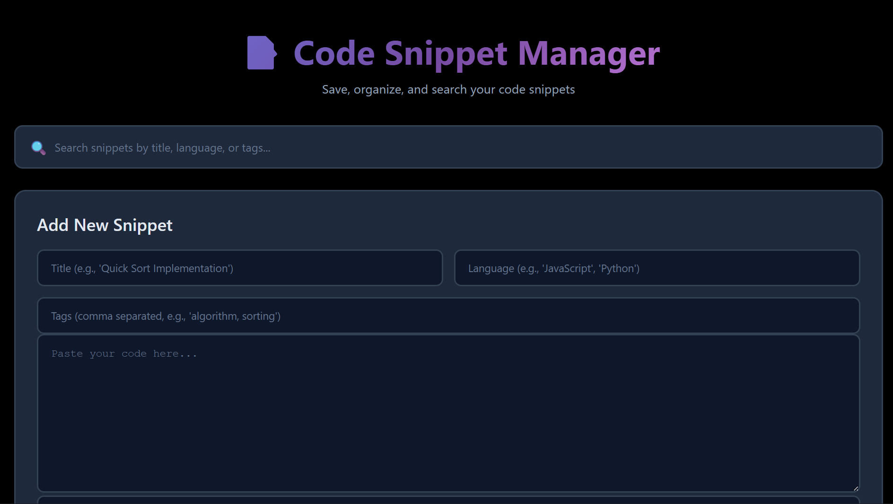

# 📝 Code Snippet Manager

A modern, web-based application for developers to save, organize, and search code snippets efficiently. Built with a focus on clean UI/UX and practical functionality.



## 🌟 Features

- **Save Code Snippets**: Store code snippets with title, language, tags, and description
- **Smart Search**: Real-time search across titles, languages, tags, and code content
- **Tag Organization**: Organize snippets with custom tags for easy categorization
- **Persistent Storage**: All snippets are saved to disk and persist across sessions
- **Clean UI**: Modern, dark-themed interface with smooth animations
- **Responsive Design**: Works seamlessly on desktop and mobile devices

## 🚀 Live Demo

[View Live Demo](your-deployed-url-here) *(will add after deployment)*

## 🛠️ Tech Stack

**Frontend:**
- HTML5
- CSS3 (Custom styling with gradients and animations)
- Vanilla JavaScript (ES6+)

**Backend:**
- Node.js
- Express.js
- File-based storage (JSON)

**APIs:**
- RESTful API for CRUD operations

## 📋 API Endpoints

| Method | Endpoint | Description |
|--------|----------|-------------|
| GET | `/api/snippets` | Retrieve all snippets |
| POST | `/api/snippets` | Create a new snippet |
| DELETE | `/api/snippets/:id` | Delete a snippet by ID |

## 💻 Local Installation

1. **Clone the repository**
```bash
git clone https://github.com/YOUR_USERNAME/code-snippet-manager.git
cd code-snippet-manager
```

2. **Install dependencies**
```bash
npm install
```

3. **Start the server**
```bash
npm start
```

4. **Open in browser**
```
http://localhost:3000
```

## 📂 Project Structure
```
code-snippet-manager/
├── index.html          # Main HTML file
├── style.css           # Styling and animations
├── app.js              # Frontend JavaScript logic
├── server.js           # Express backend server
├── snippets.json       # Data persistence file
├── package.json        # Node.js dependencies
└── README.md           # Project documentation
```

## 🎯 Key Learning Points

- **RESTful API Design**: Implemented CRUD operations following REST principles
- **Asynchronous JavaScript**: Used async/await for API calls and data handling
- **DOM Manipulation**: Dynamic rendering of snippets without page reload
- **Data Persistence**: File-based storage system for saving user data
- **Responsive Web Design**: CSS Grid and Flexbox for layout
- **User Experience**: Real-time search and smooth animations

## 🔮 Future Enhancements

- [ ] Syntax highlighting for different programming languages
- [ ] Export snippets to file (JSON/Markdown)
- [ ] User authentication and multi-user support
- [ ] Code execution feature for certain languages
- [ ] Browser extension for quick snippet saving
- [ ] Database integration (MongoDB/PostgreSQL)

## 👤 Author

- GitHub: @SuhGitHub(https://github.com/SuhGitHub)

## 📄 License

This project is open source and available under the [MIT License](LICENSE).

---

⭐ If you found this project helpful, please give it a star!